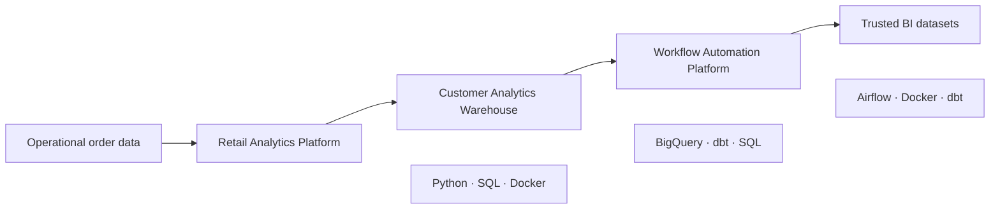

# Jonathon Watterson

### Data Engineer building reliable, production-minded analytics platforms

I design data systems that turn operational data into trusted, decision-ready
analytics. My work emphasizes the engineering around the pipeline—not only the
transformation logic, but also data contracts, idempotency, testing,
orchestration, observability, deployment, and recovery.

## Northwind Outfitters Data Platform

My featured portfolio follows one fictional ecommerce company, **Northwind
Outfitters**, as its data infrastructure evolves from a local ETL pipeline into
a governed, automated analytics platform.

Each repository solves the next realistic business problem and builds on the
systems that came before it:

### 01 — [Retail Analytics Platform](https://github.com/j-watterson/retail-analytics-platform)

**Business problem:** Manual sales reporting was slow, inconsistent, and unable
to surface bad source records.

An automated Python and SQL ETL platform that validates retail orders,
quarantines invalid rows, builds a dimensional SQLite warehouse, and publishes
reusable sales views.

`Python` · `SQL` · `SQLite` · `Docker` · `GitHub Actions`

**Engineering highlights:** Transactional and idempotent loads, source-checksum
deduplication, natural-key upserts, audit history, structured logging,
configuration, automated tests, and a non-root container.

---

### 02 — [Customer Analytics Warehouse](https://github.com/j-watterson/customer-analytics-warehouse)

**Business problem:** Finance, marketing, and merchandising needed one governed
source for customer and sales reporting.

A centralized BigQuery warehouse managed with dbt. It transforms raw commerce
data into conformed dimensions, an incremental order fact, a customer 360, and
finance-ready daily sales models.

`BigQuery` · `dbt` · `SQL` · `Docker` · `GitHub Actions`

**Engineering highlights:** Layered warehouse modeling, incremental merges,
date partitioning, query-oriented clustering, late-arriving-data handling,
source freshness checks, relationship tests, dbt unit tests, snapshots, and a
governed metric catalog.

---

### 03 — [Workflow Automation Platform](https://github.com/j-watterson/workflow-automation-platform)

**Business problem:** Reliable warehouse models still depended on manual
execution, leaving dashboards vulnerable to missed or partial refreshes.

An Airflow orchestration layer that validates upstream deliveries, checks dbt
source freshness, builds warehouse layers in dependency order, runs independent
BI marts in parallel, and enforces a final quality gate.

`Apache Airflow` · `Python` · `dbt` · `PostgreSQL` · `Docker Compose`

**Engineering highlights:** Explicit daily data intervals, exponential retries,
execution timeouts, concurrency controls, structured failure callbacks,
parallel task groups, controlled backfills, and operational runbooks.

## Platform Capabilities

| Capability | Implementation |
| --- | --- |
| Batch ingestion | Configured Python ETL with schema and business-rule validation |
| Data modeling | Dimensional facts and conformed customer, product, and date dimensions |
| Cloud warehouse | Incremental, partitioned, and clustered BigQuery models |
| Data quality | Source contracts, quarantined records, dbt tests, and final quality gates |
| Orchestration | Timezone-aware Airflow DAGs with retries, timeouts, and backfills |
| Reliability | Idempotency, transactional loads, audit tables, and late-arriving-data handling |
| Delivery | Docker, Docker Compose, automated tests, and GitHub Actions |
| Operations | Structured logs, failure context, architecture guides, and recovery runbooks |

## How I Approach Data Engineering

- Start with the business decision and define trustworthy outputs.
- Make data contracts and failure behavior explicit.
- Design pipelines to be safe to retry and straightforward to operate.
- Keep business logic version-controlled, tested, and documented.
- Treat observability, security, scalability, and recovery as core features.
- Document tradeoffs and the path from a portfolio implementation to production.

## Current Toolkit

- **Languages:** Python, SQL
- **Data modeling:** dbt, dimensional modeling, incremental processing
- **Warehousing:** BigQuery, SQLite
- **Orchestration:** Apache Airflow
- **Engineering:** Docker, Docker Compose, GitHub Actions, automated testing
- **Practices:** Data quality, idempotency, observability, CI/CD, runbooks

## What Comes Next

The platform roadmap continues with:

1. A data-quality platform for proactive validation and anomaly detection
2. Real-time order analytics with Kafka
3. A lakehouse separating raw, clean, and curated data
4. Customer churn and inventory forecasting pipelines
5. APIs, cloud infrastructure, and deployment automation

## Connect

- [Portfolio](https://www.jwatterson.com/)
- [LinkedIn](https://www.linkedin.com/in/jw-data/)
- [Email](mailto:jwatterson99@proton.me)
